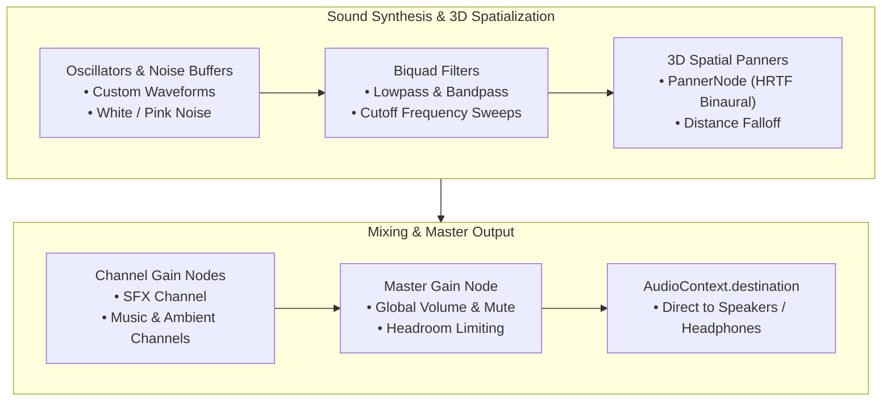

# Procedural Web Audio Engine

Synthesize dynamic 8-bit and modular audio directly in the browser with native Web Audio API oscillators, biquad filters, and 3D binaural HRTF panners—zero external audio files required.



---

## 1. Initializing the Audio Engine (`AudioEngine.js`)

```javascript
import { AudioEngine, ProceduralSFX } from 'asciilib-3d';

const audio = new AudioEngine({
  masterVolume: 0.8,
  autoInit: true // Automatically unlocks on first user click or keypress
});

const sfx = new ProceduralSFX(audio);
```

### Master Volume & Mute Controls

```javascript
// Change master volume (0.0 to 1.0)
audio.setMasterVolume(0.5);

// Toggle mute / unmute
const isMuted = audio.toggleMute();
```

---

## 2. Procedural Sound Synthesizers (`ProceduralSFX.js`)

All effects are synthesized mathematically using oscillators and bandpass-filtered noise bursts.

### Player Locomotion

```javascript
// Realistic footstep on concrete / pavement
sfx.playFootstep('concrete', { volume: 0.25 });

// Footstep on metal grating or wood
sfx.playFootstep('metal', { volume: 0.30 });
sfx.playFootstep('wood', { volume: 0.25 });

// Athletic jump push-off (shoe friction + ground impulse)
sfx.playJump({ volume: 0.35 });

// Landing impact with body weight damping
sfx.playLand({ volume: 0.40 });
```

### UI & Feedback Tones

```javascript
sfx.playUiBeep('click');    // Menu button click
sfx.playUiBeep('confirm');  // Game start / success chime
sfx.playUiBeep('cancel');   // Pause / escape tone
sfx.playUiBeep('error');    // Low warning buzzer
```

### Game Action SFX

```javascript
sfx.playLaser({ volume: 0.4 });       // Sci-fi laser zap
sfx.playPowerUp({ volume: 0.5 });     // Ascending arpeggio
sfx.playImpact(1.5);                  // Heavy collision thud
```

### Continuous Ambient & Vehicle Audio

```javascript
// Atmospheric cyberpunk city rumble (55Hz transformer + filtered wind)
const cityHum = sfx.createAmbientCityHum({ humVolume: 0.22, windVolume: 0.15 });

// Stop ambient audio when paused
cityHum.stop();

// Dynamic vehicle engine (adjust pitch with speed)
const engine = sfx.createEngineHum({ baseFreq: 65, volume: 0.4 });
engine.setSpeed(1.8); // Accelerates motor tone

// Dual-rotor surveillance drone hum
const droneRotor = sfx.createDroneHum({ volume: 0.35 });
droneRotor.setRotorSpeed(1.2);
```

---

## 3. Positional 3D Spatial Audio

`asciilib` supports 3D spatialized audio with HRTF (Head-Related Transfer Function) binaural panning:

```javascript
// Create a 3D panner located at a car's world coordinates
const panner = audio.createPanner(car.x, car.y, car.z, {
  rolloffFactor: 1.5,
  maxDistance: 60.0
});

// Update panner position each frame as the car moves
panner.setPosition(car.x, car.y, car.z);

// Attach panner to sound effects
sfx.playImpact(1.0, { panner });

// In your game loop, keep the audio listener synced to the camera:
function gameLoop() {
  audio.updateListener(camera);
}
```

---

## 4. Chiptune Music Tracker (`SynthTracker.js`)

Compose and playback multi-note 8-bit sequences:

```javascript
import { SynthTracker } from 'asciilib-3d';

const tracker = new SynthTracker(audio);

// Play a retro melody
const sequence = ['C4', 'E4', 'G4', 'B4', 'C5', null, 'G4', 'C5'];
tracker.playSequence(sequence, { bpm: 140, type: 'square', volume: 0.25 });
```
