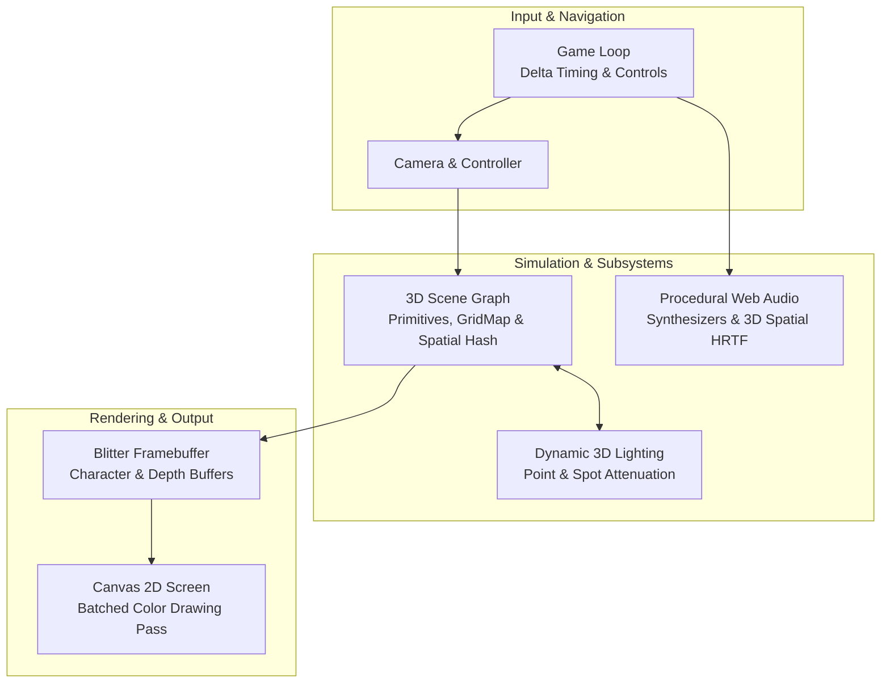

---
hide:
  - title
---

<div class="asciilib-hero">

<pre class="asciilib-banner-pre">
                             ███   ███  ████   ███  █████       
                            ▒▒▒   ▒▒▒  ▒▒███  ▒▒▒  ▒▒███        
  ██████    █████   ██████  ████  ████  ▒███  ████  ▒███████    
 ▒▒▒▒▒███  ███▒▒   ███▒▒███▒▒███ ▒▒███  ▒███ ▒▒███  ▒███▒▒███   
  ███████ ▒▒█████ ▒███ ▒▒▒  ▒███  ▒███  ▒███  ▒███  ▒███ ▒███   
 ███▒▒███  ▒▒▒▒███▒███  ███ ▒███  ▒███  ▒███  ▒███  ▒███ ▒███   
▒▒████████ ██████ ▒▒██████  █████ █████ █████ █████ ████████    
 ▒▒▒▒▒▒▒▒ ▒▒▒▒▒▒   ▒▒▒▒▒▒  ▒▒▒▒▒ ▒▒▒▒▒ ▒▒▒▒▒ ▒▒▒▒▒ ▒▒▒▒▒▒▒▒     
</pre>

<div class="asciilib-subtitle">
A zero-dependency, pure JavaScript 3D ASCII graphics, physics, and procedural audio engine for the modern web.
</div>

<div class="asciilib-badges">
  
  
</div>

</div>

---

## Key Highlights

- **Zero External Dependencies**: Pure vanilla JavaScript. No Three.js, no WebGL, no heavy binaries.
- **Ultra-Fast 3D Pipeline**: Raycasting + Analytical Ray-Primitive Intersections + Character Z-Buffer + Batched Canvas 2D Blitter.
- **Dynamic 3D Lighting**: Real-time Euclidean point lights, spotlights, flashlight beams, and character density modulation.
- **Procedural Web Audio**: Built-in synthesizer engine powered purely by native Web Audio API oscillators and noise filters with support for custom audio files.
- **2D ASCII Map Serialization**: Design entire 3D towns directly from plain text blueprint strings.
- **Autonomous Prefab AI**: Traffic-compliant vehicles, overhead companion escort surveillance drones, and pedestrians.

---

## Installation

### Node.js / NPM

```bash
npm install asciilib-3d
```

### Modern ES Module Import

```javascript
import {
  Blitter,
  Camera,
  Scene,
  GridMapRaycaster,
  BoxEntity,
  AudioEngine,
  ProceduralSFX,
  parseAsciiMap
} from 'asciilib-3d';
```

### Direct Script Tag (No Build Step)

```html
<script type="module">
  import { Blitter, Camera, Scene, BoxEntity } from './src/index.js';
</script>
```

---

## Interactive Demos

Experience `asciilib` running live directly in your browser:

| Showcase | Description | Live Link |
| :--- | :--- | :---: |
| **ASCIITY Metropolis** | Cyberpunk metropolis with 25 intersections, traffic IA, and skyscrapers | [Launch Demo](https://raymondev.github.io/asciilib/examples/asciity/) |
| **Templates World** | Comprehensive showcase with all primitives, materials, and companion drone | [Launch Demo](https://raymondev.github.io/asciilib/examples/templates_world/) |
| **Dynamic Lighting** | Real-time Euclidean point lights, drone searchlights, and flashlight beam | [Launch Demo](https://raymondev.github.io/asciilib/examples/light_test/) |
| **2D ASCII Map Test** | Multi-block town rendered directly from a 2D ASCII blueprint string | [Launch Demo](https://raymondev.github.io/asciilib/examples/map_test/) |

---

## Architecture Overview


