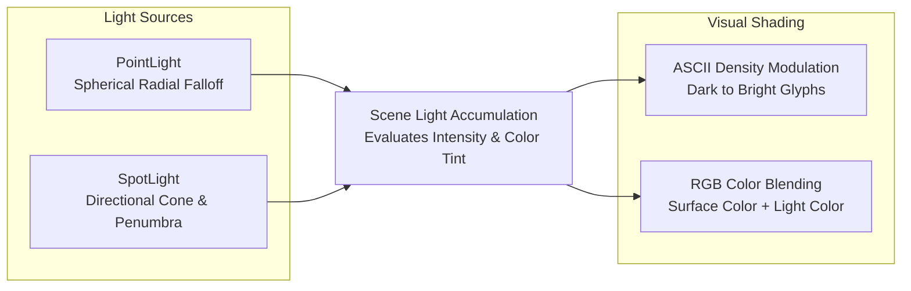

# Dynamic 3D Lighting System

Modulate scene luminance and color in real time through analytical Euclidean distance attenuation, spotlight angular gating, and character density ramp evaluation.



---

## 1. Light Types

### PointLight (Omnidirectional)

Simulates light radiating in all directions from a single point (such as a street lamp bulb, torch, or explosion):

```javascript
import { PointLight } from 'asciilib-3d';

const lampLight = new PointLight({
  x: 18.0,
  y: 18.0,
  z: 2.85,           // Elevation in meters
  color: '#ffeaa7',  // Warm sodium yellow
  radius: 9.0,       // Max reach in meters
  intensity: 1.2,    // Power multiplier
  decay: 1.0         // Falloff exponent (1.0 = linear, 2.0 = quadratic)
});

scene.addLight(lampLight);
```

### SpotLight (Directional Cone)

Simulates a directional cone of light (such as a drone searchlight, flashlight, or vehicle headlight):

```javascript
import { SpotLight } from 'asciilib-3d';

const searchlight = new SpotLight({
  x: 20.0,
  y: 20.0,
  z: 6.0,
  color: '#00f0ff',              // Cyan beam
  radius: 16.0,
  intensity: 1.5,
  angle: Math.PI / 5,            // 36° cone half-angle
  penumbra: 0.30,                // Edge softening
  direction: { x: 0, y: 0, z: -1 } // Pointing straight down
});

scene.addLight(searchlight);
```

---

## 2. Character Luminance & Color Utilities

### Modulating ASCII Density (`modulateCharLuminance`)

As light hits a surface, the character shifts smoothly across the standard luminance ramp (` .:-=+*#%@`):

```javascript
import { modulateCharLuminance } from 'asciilib-3d';

// In full darkness -> " " or "."
const darkChar = modulateCharLuminance('#', 0.15); // Returns "."

// Under bright spotlight -> original or dense "#" / "@"
const litChar = modulateCharLuminance('#', 1.2);   // Returns "#"
```

### Blending Dynamic Light Color (`blendLightColor`)

Tints a surface's base color with the accumulated light color:

```javascript
import { blendLightColor } from 'asciilib-3d';

// Base dark asphalt (#334155) tinted with warm lamp light
const litColor = blendLightColor('#334155', lighting.r, lighting.g, lighting.b, lighting.intensity);
```

---

## 3. Querying Scene Lighting

Inside any shader, entity render function, or game loop:

```javascript
// Query cumulative light at any 3D coordinate
const lighting = scene.getLightingAt(worldX, worldY, worldZ);
// lighting.intensity (Float, e.g. 1.45)
// lighting.r, lighting.g, lighting.b (Normalized RGB floats)

// Get normalized 0.0-1.0 light level with ambient floor
const lightLevel = scene.getLightLevel(worldX, worldY, worldZ, 0.20);
```

---

## 4. Practical Example: Player Flashlight

Attach a dynamic `SpotLight` to the player's first-person camera:

```javascript
const flashlight = new SpotLight({
  x: camera.x,
  y: camera.y,
  z: camera.z,
  color: '#ffffff',
  radius: 20.0,
  intensity: 1.8,
  angle: Math.PI / 6
});
scene.addLight(flashlight);

// In your game loop, update flashlight position and aim:
function gameLoop(now) {
  flashlight.setPosition(camera.x, camera.y, camera.z);
  flashlight.setDirection(
    Math.cos(camera.angle),
    Math.sin(camera.angle),
    camera.pitch * 0.45
  );
}
```
