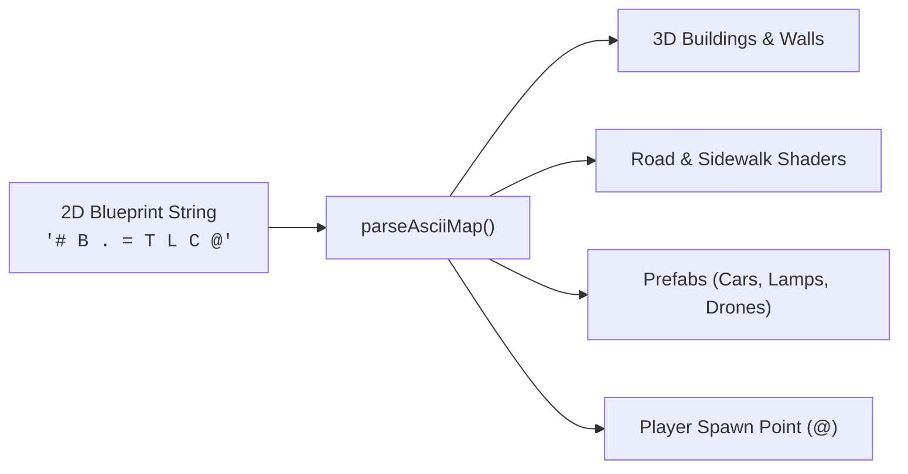

# 2D ASCII Map & Scene Serialization

Design and generate full 3D urban environments, interior dungeons, and game levels directly from plain 2D ASCII text blueprints.



---

## 1. Parsing a 2D ASCII Blueprint (`parseAsciiMap`)

```javascript
import { parseAsciiMap, Camera } from 'asciilib';

const MY_TOWN = `
  ############
  #B........B#
  #.T...L....#
  #....@.....#
  #...C...P..#
  #B........B#
  ############
`;

// Parse in a single line
const { scene, defaultSpawn, entities, mapSize } = parseAsciiMap(MY_TOWN, {
  defaultBuildingHeight: 8.0,
  cellScale: 1.0
});

// Position the player's camera right at the '@' spawn point
const camera = new Camera({
  x: defaultSpawn.x,
  y: defaultSpawn.y,
  z: 1.10,
  angle: defaultSpawn.angle || 0.0
});
```

---

## 2. Default Symbol Legend

The built-in `DEFAULT_MAP_LEGEND` provides ready-to-use symbol mappings:

| Symbol | Meaning | Tile Type | Height | Entity Generated |
| :---: | :--- | :---: | :---: | :--- |
| `#` | Building Wall | `10` | Default (6m) | Solid Wall Block |
| `B` | Skyscraper | `10` | 8.0m | Tall Building Tier |
| `H` | High-Rise Tower | `10` | 12.0m | Mega Tower |
| `.` | Road / Asphalt | `0` | 0.0m | Road Floor Tile |
| `=` | Sidewalk / Curb | `1` | 0.0m | Concrete Pavement |
| `T` | Tree | `1` | 0.0m | `createTree()` |
| `L` | Street Lamp | `1` | 0.0m | `createStreetLamp()` + PointLight |
| `S` | Traffic Signal | `1` | 0.0m | `createTrafficLight()` |
| `C` | Taxi Vehicle | `0` | 0.0m | `createTaxi()` |
| `V` | Cyber Coupe | `0` | 0.0m | `createCyberCoupe()` |
| `U` | City Bus | `0` | 0.0m | `createCityBus()` |
| `D` | Surveillance Drone | `0` | 0.0m | `createSurveillanceDrone()` + SpotLight |
| `P` | Pedestrian | `1` | 0.0m | `createPedestrian()` |
| `@` | Player Spawn | `0` | 0.0m | Registers `spawnPoint` coordinate |

---

## 3. Custom Symbols & Overrides

Extend or override the legend by passing your own dictionary:

```javascript
import { parseAsciiMap, BoxEntity } from 'asciilib';

const customMap = `
  XXX
  X@X
  XXX
`;

const result = parseAsciiMap(customMap, {
  legend: {
    'X': {
      tile: 14,
      height: 20.0,
      entity: (x, y, z) => new BoxEntity({
        x, y, z,
        sizeX: 0.9, sizeY: 0.9, sizeZ: 2.5,
        char: '%',
        color: '#ff0055',
        bg: '#200010'
      })
    }
  }
});
```

---

## 4. JSON Scene Serialization (`SceneSerializer.js`)

Save the entire live `Scene` (including all entities, building heights, tile arrays, and light sources) to a standard JSON format:

```javascript
import { serializeScene, deserializeScene } from 'asciilib';

// 1. Export Scene to JSON string
const jsonString = serializeScene(scene, { stringify: true, indent: 2 });

// 2. Load Scene back from JSON
const restoredScene = deserializeScene(jsonString);
```

---

## 5. Exporting Scene Back to ASCII (`exportAsciiMap`)

Convert any existing `Scene` back into a clean 2D ASCII character map:

```javascript
import { exportAsciiMap } from 'asciilib';

const asciiText = exportAsciiMap(scene);
console.log(asciiText);
```
