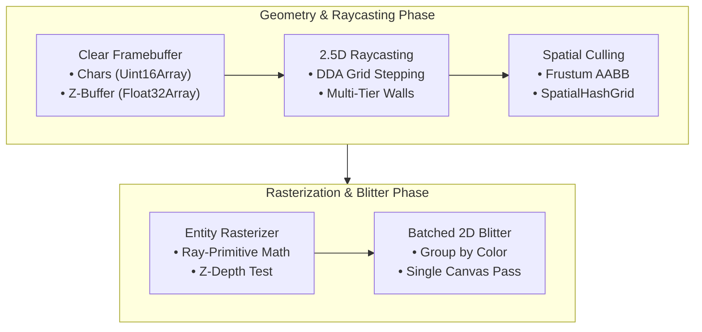

# 3D Rendering Pipeline & Blitter

The rendering subsystem implements a high-performance software rasterizer engineered specifically for character grids, combining 2.5D DDA raycasting with analytical 3D ray-primitive intersections and single-pass canvas batching.



---

## 1. The Blitter Architecture (`Blitter.js`)

At the core of the engine is the `Blitter`, which maintains an explicit character-level depth buffer and framebuffer:

```javascript
import { Blitter } from 'asciilib-3d';

const blitter = new Blitter(160, 90, 7, 10);
```

### Framebuffer Buffers

| Buffer | Type | Description |
| :--- | :--- | :--- |
| `frameCharCodes` | `Uint16Array(cols * rows)` | Character UTF-16 code (e.g. `35` for `#`) |
| `frameColors` | `Array(cols * rows)` | Foreground text color string (`#ffffff`) |
| `frameBgs` | `Array(cols * rows)` | Background box color string (`#000000`) |
| `frameAlphas` | `Float32Array(cols * rows)` | Opacity / fog blending factor (`0.0` to `1.0`) |
| `pixelDepthBuffer` | `Float32Array(cols * rows)` | Per-character Z-depth distance in meters |

### Character Depth Testing

Before writing a character to a cell `(col, row)`, the blitter compares its distance against `pixelDepthBuffer`:

```javascript
const dist = 12.5; // Distance in world meters

if (dist < blitter.getDepth(col, row)) {
  blitter.setDepth(col, row, dist);
  blitter.drawOpaqueChar(col, row, '#', '#00f0ff', 1.0, '#082f49');
}
```

### Color Batching Optimization

Calling `ctx.fillStyle` for every single cell is slow. `Blitter.blit()` automatically groups identical colors across the frame, drawing dozens of characters in a single batched Canvas 2D draw call:

```javascript
// Batch blit to HTML5 Canvas
blitter.blit(ctx, canvasWidth, canvasHeight, fontStyle);
```

---

## 2. Multi-Tier 2.5D Raycasting (`GridMapRaycaster.js`)

The `GridMapRaycaster` uses an extended DDA (Digital Differential Analyzer) algorithm capable of rendering **multi-tiered skyscrapers with arbitrary setbacks**:

```javascript
import { GridMapRaycaster } from 'asciilib-3d';

const raycaster = new GridMapRaycaster({ maxDepth: 65.0 });

// Render walls and floors with optional custom shaders
raycaster.render(scene, camera, blitter, {
  wallShader: myWallShader,
  floorShader: myFloorShader
});
```

### How Multi-Tier Stepping Works

1. For each screen column, the ray steps through grid cells using DDA.
2. When the ray hits a building cell with height H1, it records a wall tier.
3. If the ray continues behind that building and encounters a taller tower with height H2 > H1, it records a second tier.
4. The renderer sorts tiers front-to-back and clips vertical screen boundaries using `topClip`, eliminating overdraw while correctly displaying multi-setback skyscrapers.

---

## 3. Spatial Frustum Culling (`SpatialHashGrid.js`)

Rather than iterating over thousands of entities every frame, `Scene` divides the 2D world into uniform spatial buckets (8.0 × 8.0 m):

```text
+---+---+---+---+
| . | . | T | . |   T = Static Tree
+---+---+---+---+
| . | C | . | . |   C = Moving Car
+---+---+---+---+
| . | . | @ | . |   @ = Camera Frustum Query
+---+---+---+---+
```

During rendering, `camera.getFrustumAABB()` computes the bounding box of the camera's field of view and queries only the relevant buckets:

```javascript
const frustum = camera.getFrustumAABB();
const visibleStatic = [];
scene.staticGrid.queryAABB(frustum.minX, frustum.minY, frustum.maxX, frustum.maxY, visibleStatic);
```

---

## 4. Analytical 3D Entity Rasterization

Entities (`BoxEntity`, `CylinderEntity`, `CompoundEntity`, etc.) are rendered using exact geometric ray-intersection math rather than polygon rasterization.

See the [3D Primitives Documentation](primitives.md) for full details on compound models and hierarchies.
